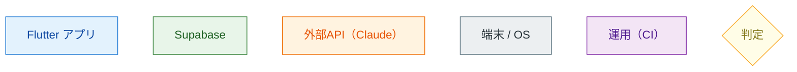
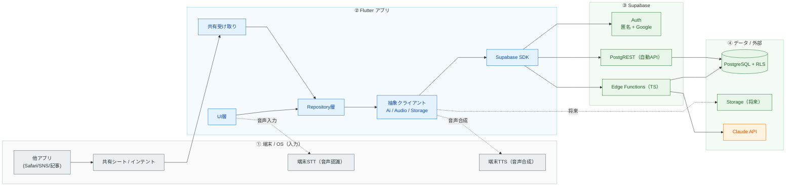
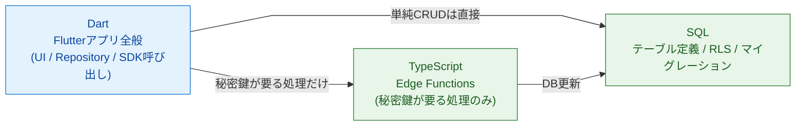
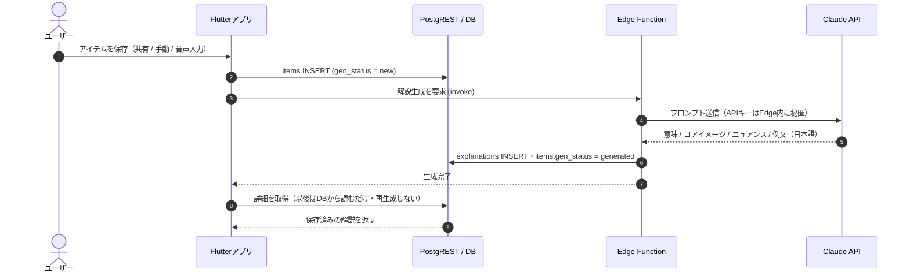
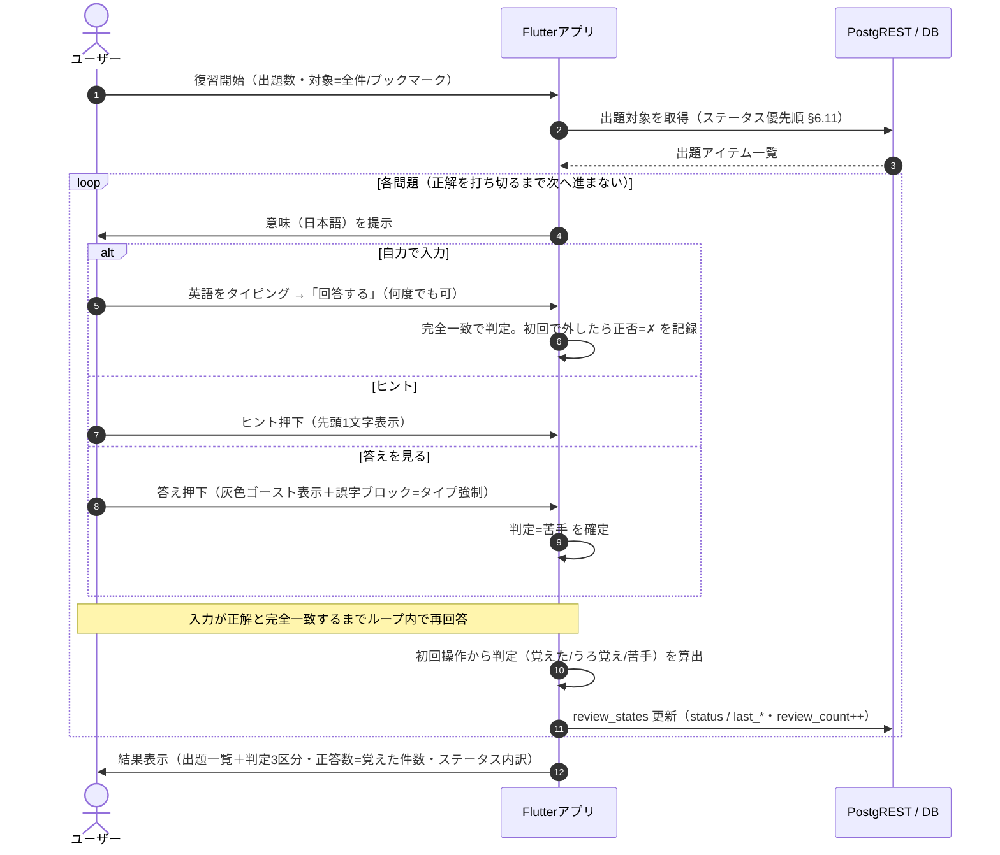
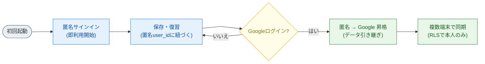
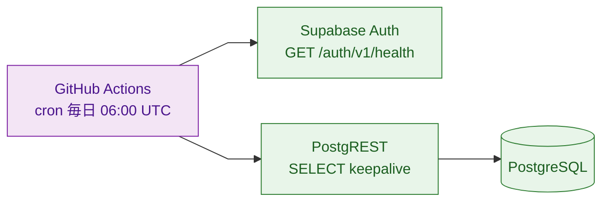

# Rakuku システム構成図

> 本書は `docs/requirements.md`（要件定義書 v1.1）に基づくシステム構成のビジュアル資料。
> 図は GitHub 上で Mermaid として描画される。

- **対象**: Rakuku MVP
- **最終更新**: 2026-06-04
- **関連**: [要件定義書](./requirements.md) ／ [画面遷移図](./screen-flow.md)
- **詳細設計**: [レイヤー・主要クラス](./design/architecture-layers.md) ／ [復習状態遷移](./design/review-state-machine.md) ／ [Edge Function IF](./design/edge-function-claude.md) ／ DDL: `supabase/migrations/`

### 図の読み方（レイアウト規約）

- **視線は左上→右下**。番号（①②③④）の順に読む。
- 主フローは**実線・一方向**、補助連携（端末機能・将来・運用）は**点線**。
- 線は**直線（折れ線）**で表示し、交差を最小化。色は意味ごとに固定（下記凡例）。

---

## 凡例（色の意味）

---

## 1. 全体構成図

> ① 入力（OS）→ ② アプリ → ③ Supabase → ④ データ/外部、の順に左→右へ流れる。点線は補助連携。

> 運用（keepalive）は独立した補助系のため §6 に分離して記載。

### 登場人物と役割

| 区分 | 要素 | 役割 |
|---|---|---|
| ① 端末/OS | 共有シート/インテント | 他アプリから「共有」でRakukuへテキストを送る入口 |
| ① 端末/OS | 端末STT | アプリ内音声入力。認識候補を返しユーザーが選択 |
| ① 端末/OS | 端末TTS | 発音確認の音声合成（無料・オフライン） |
| ② アプリ | UI層 | 画面・操作 |
| ② アプリ | Repository層 | データアクセスを集約（ベンダー直叩きを隠蔽し移植性を確保） |
| ② アプリ | 抽象クライアント | AI/音声/ストレージを差し替え可能にするインターフェース |
| ③ Supabase | Auth | 匿名サインイン＋Googleログイン＋昇格 |
| ③ Supabase | PostgREST | テーブルから自動生成されるREST API（自前API不要） |
| ③ Supabase | Edge Functions | 秘密鍵が要る処理のみ（Claude中継） |
| ④ データ/外部 | PostgreSQL+RLS | データ本体。RLSで「自分のデータのみ」を強制 |
| ④ データ/外部 | Claude API | 解説・コアイメージ・例文の生成 |

---

## 2. 実装言語・責務の分離

> 単純CRUD（保存・取得・同期・苦手フラグ等）は**サーバコードを書かず** Flutterから直接DBへ（RLSが安全性を担保）。
> Claude呼び出しなど**秘密鍵が要る処理だけ** Edge Function（TypeScript）を経由する。

---

## 3. シーケンス：アイテム保存とAI生成

---

## 4. シーケンス：復習（タイピング想起）と学習ステータス更新

---

## 5. フロー：認証（匿名スタート → Google昇格）

---

## 6. 構成：Supabase 凍結回避（keepalive）

> プロジェクト停止を防ぐには**外部からの定期アクセスが必須**。詳細は要件定義書 §13 を参照。

---

*本書は要件定義書 v1.1 に追従する。要件変更時は本図も更新する。*
