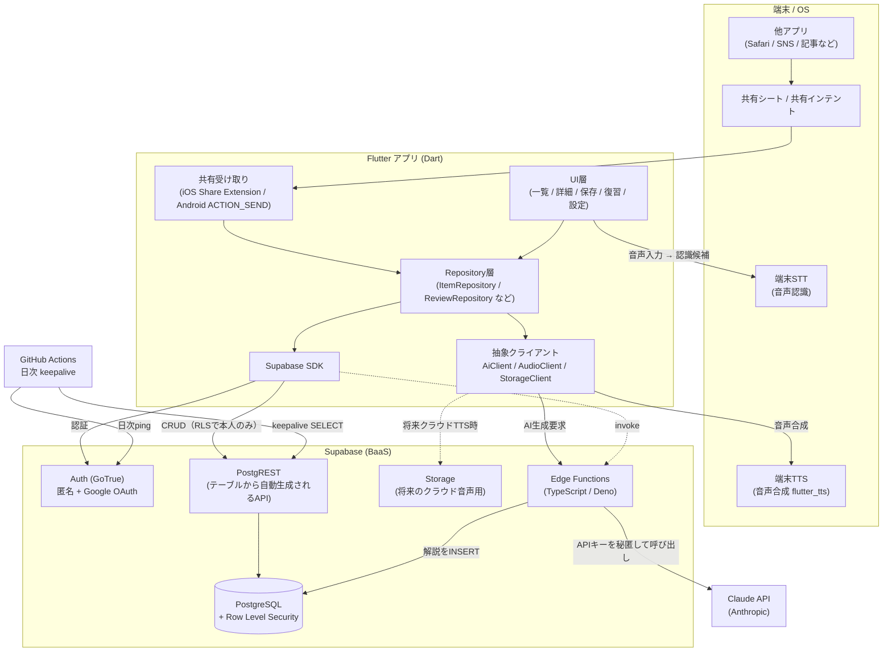
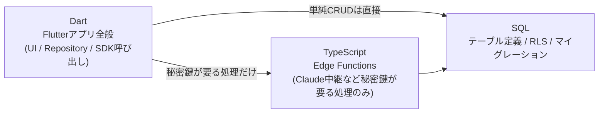
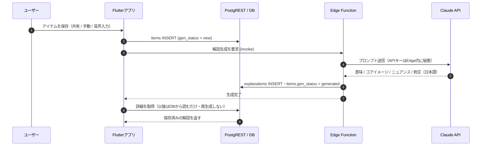
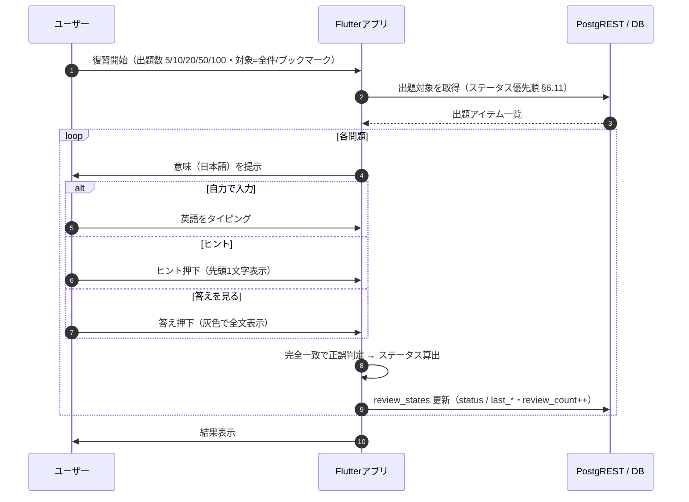
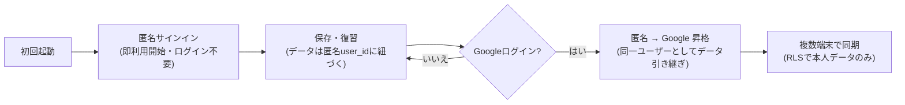
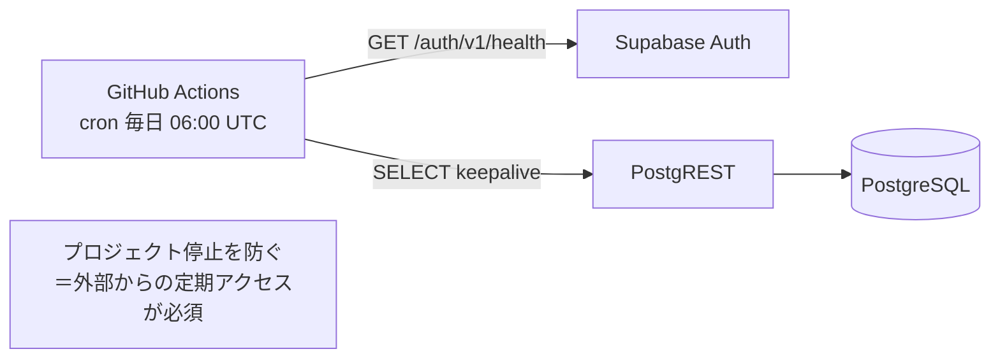

# Rakuku システム構成図

> 本書は `docs/requirements.md`（要件定義書 v1.1）に基づくシステム構成のビジュアル資料。
> 図は GitHub 上で Mermaid として描画される。

- **対象**: Rakuku MVP
- **最終更新**: 2026-06-04
- **関連**: [要件定義書](./requirements.md)

---

## 1. 全体構成図

### 登場人物と役割

| 区分 | 要素 | 役割 |
|---|---|---|
| 端末/OS | 共有シート/インテント | 他アプリから「共有」でRakukuへテキストをDownする入口 |
| 端末/OS | 端末STT | アプリ内音声入力。認識候補を返しユーザーが選択 |
| 端末/OS | 端末TTS | 発音確認の音声合成（無料・オフライン） |
| アプリ | UI層 | 画面・操作 |
| アプリ | Repository層 | データアクセスを集約（ベンダー直叩きを隠蔽し移植性を確保） |
| アプリ | 抽象クライアント | AI/音声/ストレージを差し替え可能にするインターフェース |
| Supabase | Auth | 匿名サインイン＋Googleログイン＋昇格 |
| Supabase | PostgREST | テーブルから自動生成されるREST API（自前API不要） |
| Supabase | PostgreSQL+RLS | データ本体。RLSで「自分のデータのみ」を強制 |
| Supabase | Edge Functions | 秘密鍵が要る処理のみ（Claude中継） |
| 外部 | Claude API | 解説・コアイメージ・例文の生成 |
| 運用 | GitHub Actions | 無料枠の凍結回避（日次ping） |

---

## 2. 実装言語・責務の分離

> 単語帳の保存・取得・同期・苦手フラグ等の**単純CRUDはサーバコードを書かず** Flutterから直接DBへ（RLSが安全性を担保）。
> Claude呼び出しなど**秘密鍵が要る処理だけ** Edge Function（TypeScript）を経由する。

---

## 3. シーケンス：アイテム保存とAI生成

---

## 4. シーケンス：復習（タイピング想起）と学習ステータス更新

### ステータス判定ルール（§5.9）

| 直近の結果 | ステータス |
|---|---|
| 復習0回 | 未復習 |
| ヒント未使用・答えを見ず一発正解 | 覚えた |
| ヒントを使って正解 | うろ覚え |
| 答えを見た／自力で不正解 | 苦手 |

---

## 5. フロー：認証（匿名スタート → Google昇格）

---

## 6. 構成：Supabase 凍結回避（keepalive）

> 詳細は要件定義書 §13 を参照。スケジュール実行はデフォルトブランチのワークフローのみ動作するため、マージが必要。

---

*本書は要件定義書 v1.1 に追従する。要件変更時は本図も更新する。*
