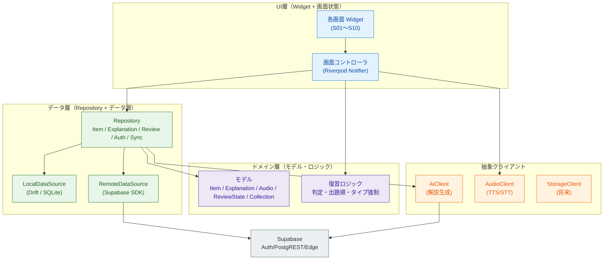

# Rakuku レイヤー構成・主要クラス（詳細設計 lite）

> アプリ内部の層分けと主要クラスの責務を1枚にまとめた軽量設計。
> フルUMLクラス図は MVP では作らず、本書（責務＋関係）で代替する。
> 関連: [システム構成図](../architecture.md) ／ [ER図](../er-diagram.md) ／ [要件定義書](../requirements.md)

- **対象**: Rakuku MVP（Flutter + Supabase）
- **最終更新**: 2026-06-04

---

## 0. 技術選定（フェーズ2で確定）

| 項目 | 採用（推奨） | 備考 |
|---|---|---|
| 状態管理 | **Riverpod**（推奨） | 画面状態・依存注入を一元化。Bloc等も可 |
| ローカルDB | **Drift（SQLite）**（推奨） | offline-first。サーバと同型のテーブルを持ち同期 |
| バックエンドSDK | `supabase_flutter` | Auth / PostgREST / Edge Functions |
| ID生成 | UUIDv7（`uuid` パッケージ） | クライアント生成（§ER） |
| 音声 | 端末TTS（`flutter_tts`）/ STT（`speech_to_text`） | `AudioClient` 抽象で将来クラウドTTSへ |

> Riverpod / Drift は推奨。最終決定はフェーズ2入口で行う（未確定）。

---

## 1. レイヤー構成



**依存方向**：UI → ドメイン → データ → 外部。上位は下位のインターフェースにのみ依存する（逆流させない）。

---

## 2. 主要クラスと責務

### ドメインモデル（ER図と1対1）
| クラス | 対応テーブル | 主なフィールド | 備考 |
|---|---|---|---|
| `Item` | items | itemId, userId, collectionId?, sourceText, itemType, inputMethod, isBookmarked, genStatus, createdAt, updatedAt | 保存アイテム |
| `Explanation` | explanations | explanationId, itemId, meaning, coreImage, nuance, examples[], model | AI解説（0/1） |
| `Audio` | audios | audioId, itemId, target, storagePath? | クラウドTTS時のみ |
| `ReviewState` | review_states | reviewStateId, itemId, userId, status, lastReviewedAt?, lastUsedHint?, lastRevealed?, lastCorrect?, reviewCount | 学習状態（1対1） |
| `Collection` | collections | collectionId, userId, name | MVPは既定1件 |
| `Example`（値） | (explanations.examples 内) | en, ja | jsonb の要素 |

### Repository
| クラス | 責務 | 主メソッド（例） |
|---|---|---|
| `ItemRepository` | アイテムCRUD・一覧・絞り込み | `create(Item)`, `list({bookmarkedOnly})`, `get(id)`, `delete(id)`, `setBookmark(id,bool)` |
| `ExplanationRepository` | 解説の取得・生成依頼・保存 | `getByItem(itemId)`, `generate(itemId)`（AiClient経由） |
| `ReviewRepository` | 出題対象取得・結果保存 | `buildSession({count,bookmarkedOnly})`, `submitResult(ReviewResult)` |
| `AuthRepository` | 匿名開始・Google昇格・状態 | `ensureAnonymous()`, `signInWithGoogle()`, `currentUser` |
| `SyncService` | ローカル↔リモート同期（LWW） | `pushPending()`, `pullChanges()`, `onConnectivityRestored()` |

### 抽象クライアント（差し替え可能）
| インターフェース | 実装（MVP） | 将来 |
|---|---|---|
| `AiClient` | Edge Function 経由で Claude 呼び出し | モデル差し替え |
| `AudioClient` | 端末TTS（`flutter_tts`）/ STT | クラウドTTS |
| `StorageClient` | （未使用） | Supabase Storage |

### UI・状態
| クラス | 責務 |
|---|---|
| 各画面 Widget（S01〜S10） | 描画のみ。状態はコントローラから受け取る |
| `ReviewSessionController` | 復習1セッションの状態機械を保持（[状態遷移図](./review-state-machine.md)） |
| `HomeController` / `ItemDetailController` 等 | 一覧・詳細の取得と操作 |

---

## 3. 想定ディレクトリ構成（案）

```
lib/
  main.dart
  app/                 # テーマ(ColorScheme=確定トークン)・ルーティング・DI
  core/                # 共通(エラー・結果型・uuid・日時)
  domain/
    models/            # Item, Explanation, ReviewState, ...
    review/            # 判定・出題順・タイプ強制ロジック
  data/
    local/             # Drift(テーブル/DAO)
    remote/            # Supabase DataSource
    repositories/      # *Repository 実装
    clients/           # AiClient / AudioClient / StorageClient
  features/
    home/ detail/ add/ review/ settings/ share/   # 画面＋Controller
supabase/
  migrations/          # DDL（本リポジトリ既存）
  functions/           # Edge Functions（生成）
```

---

*本書は要件定義書 v1.1／ER図に追従する。技術選定の確定・実装で差異が出たら更新する。*
