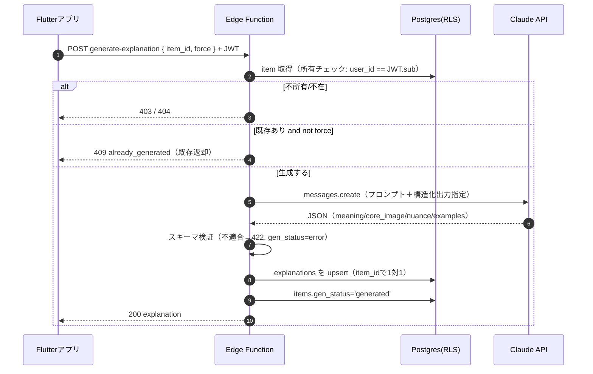

# Rakuku Edge Function: 解説生成IF（詳細設計 lite）

> 保存アイテムの英語表現について、Claude で日本語の解説（意味・コアイメージ・ニュアンス・例文）を
> 生成する Edge Function の外部インターフェース設計。鍵秘匿・コスト抑制・エラー方針を含む。
> 関連: [要件定義書 §5.2/§9](../requirements.md) ／ [ER図 explanations](../er-diagram.md) ／ [システム構成図](../architecture.md)

- **対象**: `generate-explanation`（Supabase Edge Function / TypeScript）
- **最終更新**: 2026-06-04

---

## 1. 目的と方針

- **鍵秘匿**：Claude APIキーは Edge Function（service role）内のみで使用。クライアントに出さない。
- **コスト抑制**：1アイテム原則**1回だけ生成**し、結果を `explanations` に保存（再表示は再生成しない／明示操作時のみ再生成）。
- **認可**：呼び出しは認証済みユーザーのJWTを必須。対象 `item_id` が呼び出しユーザー所有であることを関数内で検証してから生成。
- **生成はサーバ側DB書き込みまで**：関数が `explanations` を upsert し、`items.gen_status` を更新する。

---

## 2. エンドポイント

```
POST /functions/v1/generate-explanation
Authorization: Bearer <ユーザーJWT>
Content-Type: application/json
```

### リクエスト
```jsonc
{
  "item_id": "0190a3c2-1f4e-7c3a-8b2d-1a2b3c4d5e6f", // 必須: 対象アイテム
  "force": false                                       // 任意: trueで再生成（既存があっても上書き）
}
```
> `source_text` 等は関数側が `item_id` からDB取得する（クライアント入力を信用しない）。

### レスポンス（200）
```jsonc
{
  "item_id": "0190...",
  "explanation": {
    "meaning":    "意味・訳（日本語）",
    "core_image": "コアイメージ（日本語）",
    "nuance":     "ニュアンス・使いどころ（日本語）",
    "examples": [
      { "en": "Example sentence.", "ja": "例文の訳。" }
    ],
    "model": "claude-..."
  },
  "gen_status": "generated"
}
```

### エラー
| HTTP | code | 契機 | クライアント挙動 |
|---|---|---|---|
| 400 | `invalid_request` | item_id 欠落/不正 | 入力エラー表示 |
| 401 | `unauthorized` | JWT無効 | 再ログイン誘導 |
| 403 | `forbidden` | item が他ユーザー所有 | エラー表示 |
| 404 | `item_not_found` | item 不在 | エラー表示 |
| 409 | `already_generated` | 既存あり & `force=false` | 既存をDBから表示（再生成しない） |
| 422 | `generation_failed` | Claude出力がスキーマ不適合 | リトライ可。`items.gen_status=error` |
| 429 | `rate_limited` | 上流レート超過 | バックオフして再試行 |
| 5xx | `internal_error` | 想定外 | `gen_status=error`・再試行 |

> エラー時は `items.gen_status='error'` を設定し、一覧/詳細で再生成導線を出せるようにする。

---

## 3. 処理フロー



---

## 4. プロンプト設計（要旨）

- **ペルソナ**：日本語ネイティブの英語中級者（CEFR B1〜C1）向け。解説はすべて**日本語**。
- **入力**：`source_text`（英語）、`item_type`（word/phrase）。
- **出力契約**：以下キーの**JSONのみ**を返させる（前後の散文を出さない）。検証に失敗したら 422。

```jsonc
{
  "meaning":    "string  // 簡潔な意味・訳",
  "core_image": "string  // 語の核となるイメージ",
  "nuance":     "string  // ニュアンス・使い分け・レジスター",
  "examples": [ { "en": "string", "ja": "string" } ]  // 2〜3件目安
}
```

- **System**（要旨）：「あなたは英語学習者向けの日本語解説者。出力は指定JSONのみ。例文は自然で実用的、難度はB1〜C1。」
- **モデル**：最新の適切な Claude モデルを使用し、戻り値の `model` に実IDを記録（`explanations.model`）。
- **トークン上限**：例文数を絞り、`max_tokens` を抑えてコスト管理。

---

## 5. 環境変数（Edge Function）

| 変数 | 用途 |
|---|---|
| `ANTHROPIC_API_KEY` | Claude APIキー（秘匿） |
| `SUPABASE_URL` / `SUPABASE_SERVICE_ROLE_KEY` | service roleでのDB書き込み |
| `CLAUDE_MODEL`（任意） | 使用モデルIDの上書き |

> service role はRLSをバイパスするため、**関数内で必ず所有チェック**を行ってから書き込む。

---

*本書は要件定義書 §5.2/§9 と ER図に追従する。実装で確定した値（モデルID・max_tokens等）は反映する。*
