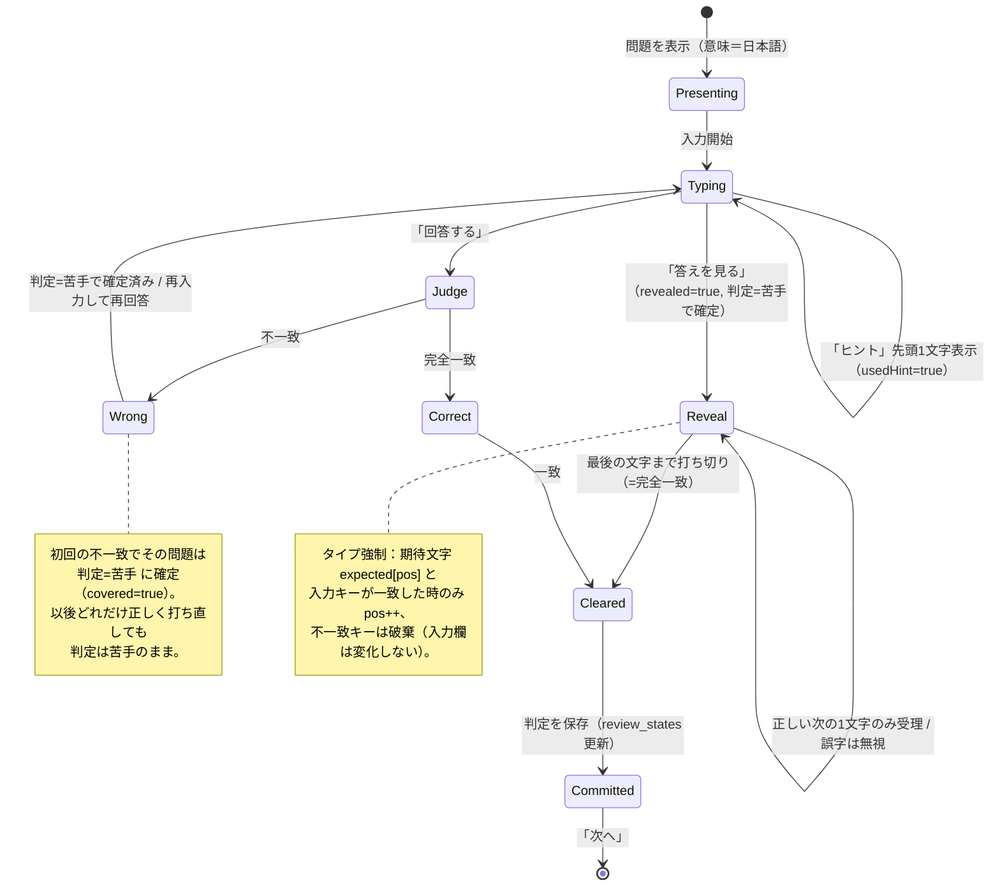

# Rakuku 復習セッション 状態遷移（詳細設計 lite）

> タイピング想起の1問あたりの状態機械。判定（覚えた/うろ覚え/苦手）の確定タイミングと
> 「正解を打ち切るまで次へ進めない」「答えを見る後の誤字ブロック（タイプ強制）」を厳密化する。
> 関連: [要件定義書 §5.5/§5.9](../requirements.md) ／ [画面遷移図](../screen-flow.md)

- **対象**: S07 復習セッション（1問の進行）
- **最終更新**: 2026-06-04

---

## 1. 1問の状態遷移



---

## 2. 状態の定義

| 状態 | 意味 | 進行可否 |
|---|---|---|
| `Presenting` | 意味を提示、入力前 | — |
| `Typing` | 自由入力中（編集自在） | 次へ不可 |
| `Judge` | 「回答する」押下の判定処理（瞬間） | — |
| `Wrong` | 直近の回答が不一致 | 次へ不可（`Typing`へ戻る） |
| `Reveal` | 答え表示＋タイプ強制中（誤字ブロック） | 次へ不可（打ち切るまで） |
| `Correct` / `Cleared` | 入力が正解と完全一致 | **次へ可** |
| `Committed` | 判定を `review_states` に保存済み | 次の問題へ |

## 3. 保持するフラグ（1問ごと）

| フラグ | 初期値 | 更新契機 |
|---|---|---|
| `usedHint` | false | 「ヒント」押下で true |
| `revealed` | false | 「答えを見る」押下で true |
| `firstAttemptMissed` | false | 初回「回答する」が不一致／または `revealed=true` で true |
| `attempts` | 0 | 「回答する」押下ごとに +1 |

## 4. 判定の確定ルール（§5.9）

判定は**初回操作で確定**し、以降は変わらない（打ち直して一致しても上書きしない）。

| 条件 | 判定 status | 正答カウント |
|---|---|---|
| `revealed=false` かつ `usedHint=false` かつ 初回「回答する」で一致 | **learned（覚えた）** | ○（正答に算入） |
| `revealed=false` かつ `usedHint=true` かつ 一致（初回一致） | **vague（うろ覚え）** | ✕ |
| `firstAttemptMissed=true`（初回で外した）または `revealed=true`（答えを見た） | **weak（苦手）** | ✕ |

> 「次へ」は **`Cleared`（完全一致を打ち切った）後のみ**有効。判定が苦手でも、正解文字列を入力し終えるまで進めない。

## 5. タイプ強制（Reveal 中）の擬似コード

```text
expected = 正解文字列
pos      = 既入力の一致長

onKey(ch):
  if state == Reveal:
    if ch == expected[pos]:
      入力欄に ch を確定描画（ゴーストを1文字ぶん消す）
      pos += 1
      if pos == expected.length: -> Cleared
    else:
      無視（入力欄もposも変化しない＝誤字ブロック）
  else:  # 通常Typing
    自由に編集可
```

- 例：`expected = "resonate"`、`pos=2`（`re`入力済）のとき、`z` は破棄、`s` のみ受理。
- バックスペースの扱いは実装時に確定（MVPは「Reveal中は後退も無効」を既定とし、迷ったら無効側）。

---

## 6. セッション終了 → 結果画面（S08）

- 全問が `Committed` になったらセッション終了。
- 結果画面に**出題アイテム一覧＋判定（覚えた/うろ覚え/苦手）**を表示。
- **正答数 = learned の件数**（§5.5/§5.9）。

---

*本書は要件定義書 §5.5/§5.9 に追従する。仕様変更時は本図も更新する。*
