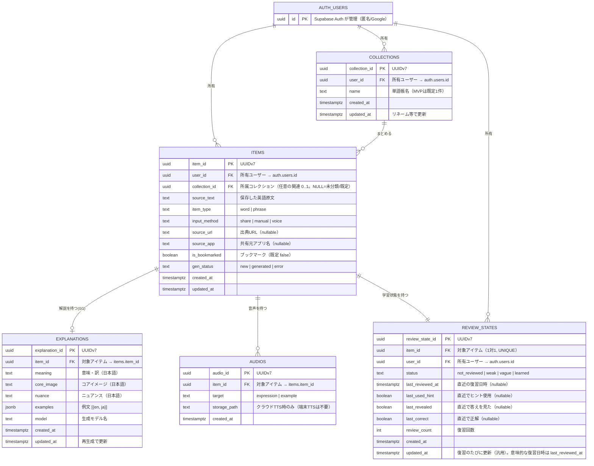

# Rakuku ER図（データモデル）

> 本書は `docs/requirements.md` §8 に基づくデータベースのER図と関係定義。
> Supabase（PostgreSQL）上のスキーマを表す。図は GitHub 上で Mermaid として描画される。

- **対象**: Rakuku MVP
- **最終更新**: 2026-06-04
- **関連**: [要件定義書](./requirements.md) ／ [システム構成図](./architecture.md)

---

## 1. ER図

> `AUTH_USERS` は Supabase Auth（`auth.users`）が管理する既存テーブル。PKは `id` 固定（変更不可）。アプリ側テーブルは `user_id` で参照する。

### PK・命名規約（確定）

- **PK名は `<entity>_id`**（例：`items.item_id`）。粒度を自己説明的にし、結合・エクスポート・手書きSQLで曖昧にしない。
  - 例外：Supabase管理の `auth.users.id` のみ `id`（変更不可）。これを参照するFKは慣例どおり `user_id`。
- **FK名は参照先のPK名をそのまま使う**（`item_id` / `collection_id` / `user_id`）。同じ列名はDB全体で同じ意味。
- **PKの型は UUIDv7**（時系列）。理由：
  - **オフライン保存→同期**のためクライアント側でID生成できる（中央採番不要）。
  - v7は先頭が時刻順で**単調増加に近く、B-treeの挿入局所性が良い**（v4のランダム性によるインデックス肥大を回避）。
  - 列挙されにくくセキュア。
- **生成方法**：クライアント（Dart）でUUIDv7を生成して保存するのを基本とする。DB側デフォルトは保険として、`uuidv7()`（Postgres 18）または `pg_uuidv7` 拡張を利用。利用可否は実装時に確認（不可なら一時的に `gen_random_uuid()`＝v4で代替し、後日v7へ）。

### 監査列（created_at / updated_at / created_by）の方針

- **`created_at`** … 全テーブルに付与。
- **`updated_at`** … **更新が発生するテーブルにのみ付与**（`items` / `explanations`〔再生成〕/ `collections`〔リネーム〕/ `review_states`〔復習更新〕）。`audios` は生成後に変化しない不変レコードのため付けない。更新時は `updated_at = now()` をアプリ or トリガで設定。
  - `review_states` は汎用の `updated_at` と、ドメイン上の意味を持つ `last_reviewed_at`（復習した日時）を**別々に**持つ。
- **`created_by` / `updated_by` は持たない**。各行は `user_id` で所有者が1人に固定される個人データのため、作成者・更新者は常に `user_id` と一致し冗長。将来「単語帳の共有・共同編集」を実装する場合に導入する。

### FKのNULL可否

- **FK制約とNOT NULLは独立**。FKは「値があれば参照先に存在する」ことのみ保証し、NULLは「関連なし」を表すため違反にならない。
- **必須の関連は NOT NULL**：`items.user_id` / `explanations.item_id` / `audios.item_id` / `review_states.item_id` / `review_states.user_id` / `collections.user_id`。親が無い子は存在し得ない。
- **任意の関連は nullable**：`items.collection_id` のみ（NULL=未分類/既定）。MVPは既定コレクション行を作らず、未指定保存を許す。
- **削除時の挙動**：`items.collection_id` は `ON DELETE SET NULL`（コレクション削除でアイテムは未分類化、消えない）。必須FKは `ON DELETE CASCADE`（親アイテム削除で解説・音声・学習状態も削除）。

---

## 2. リレーション一覧

| 親 | 子 | 多重度 | 外部キー | 削除時（ON DELETE） |
|---|---|---|---|---|
| auth.users | collections | 1 — 0..N | collections.user_id | CASCADE |
| auth.users | items | 1 — 0..N | items.user_id | CASCADE |
| collections | items | 1 — 0..N | items.collection_id（nullable） | SET NULL |
| items | explanations | 1 — 0..1 | explanations.item_id | CASCADE |
| items | audios | 1 — 0..N | audios.item_id | CASCADE |
| items | review_states | 1 — 1 | review_states.item_id（UNIQUE） | CASCADE |
| auth.users | review_states | 1 — 0..N | review_states.user_id | CASCADE |

### 補足
- **explanations は 0..1**：保存直後（`gen_status=new`）は未生成のため0件、生成後に1件。再生成は同一行を更新（履歴は持たない）。
- **review_states は 1対1**：アイテム保存時に `status=not_reviewed` で1件作成する。`item_id` に UNIQUE 制約。
- **review_states.user_id** は items 経由でも辿れるが、RLS とクエリ簡略化のため冗長に保持する。
- **audios は端末TTS方針では基本未使用**（将来クラウドTTS採用時に格納）。MVPでは空でも可。

---

## 3. RLS（行レベルセキュリティ）方針

全アプリテーブルで「本人のデータのみ」を強制する。

| テーブル | ポリシー（SELECT/INSERT/UPDATE/DELETE） |
|---|---|
| collections | `user_id = auth.uid()` |
| items | `user_id = auth.uid()` |
| review_states | `user_id = auth.uid()` |
| explanations | 親 items の `user_id = auth.uid()`（item_id 経由のサブクエリ）または生成は Edge Function（service role）で実施 |
| audios | 同上（item_id 経由） |

> explanations / audios は `user_id` を直接持たないため、`item_id` で親 items を辿って認可する（またはこれらに `user_id` を非正規化して付与する案もある）。実装時に確定。

---

## 4. 主なインデックス候補

| テーブル | インデックス | 目的 |
|---|---|---|
| items | (user_id, created_at desc) | 一覧の新着順表示 |
| items | (user_id, is_bookmarked) | ブックマーク絞り込み |
| review_states | (user_id, status, last_reviewed_at) | 出題順（ステータス優先＋古い順 §6.11） |
| explanations | (item_id) UNIQUE | 1対1の保証・結合 |
| review_states | (item_id) UNIQUE | 1対1の保証 |

---

## 5. 運用テーブル（ドメイン外）

`keepalive`（§13）は凍結回避専用のシングルトンテーブルで、ドメインモデルとは独立。本ER図には含めない。

---

*本書は要件定義書 v1.1 に追従する。スキーマ変更時は本図も更新する。*
