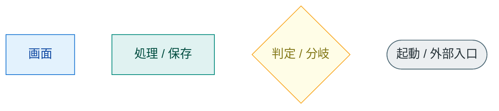
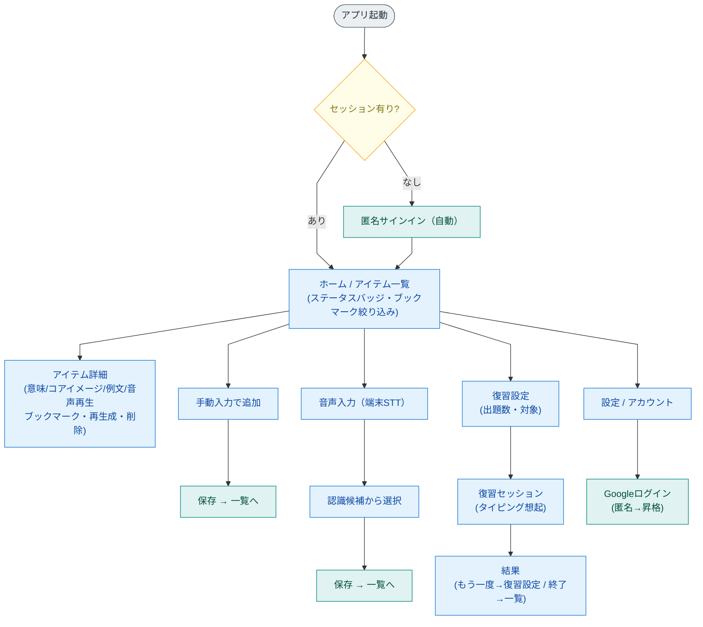
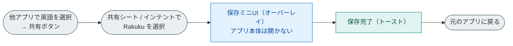
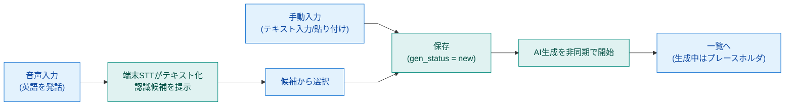
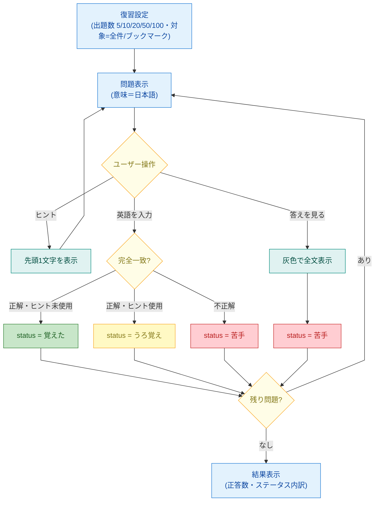

# Rakuku 画面遷移図

> 本書は `docs/requirements.md`（要件定義書 v1.1）に基づく画面遷移のビジュアル資料。
> 図は GitHub 上で Mermaid として描画される。UIのルック（色・トーン）はプロト先行で別途決定し、本書は**構造（遷移）**を定義する。

- **対象**: Rakuku MVP
- **最終更新**: 2026-06-04
- **関連**: [要件定義書](./requirements.md) ／ [システム構成図](./architecture.md)

### 図の読み方（レイアウト規約）

- **視線は上→下／左→右**。ホームを起点に主要フローへ枝分かれする。
- 線は**直線（折れ線）**・**前進方向のみ**。「戻る」「削除後の一覧復帰」は共通操作のため**線を省略**（各画面からホームへ戻れる）。
- 画面内で完結する操作は**ノード内に併記**して線を増やさない。

---

## 凡例（色の意味）

学習ステータスは復習フロー（図3）で次の4色を用いる：
🟢 覚えた ／ 🟡 うろ覚え ／ 🔴 苦手 ／ ⚪ 未復習

---

## 1. 全体の画面遷移

> ホームを起点に、**5つの主要フローが平行に下へ**伸びる。戻る操作は省略。

---

## 2. 保存の3経路

### 2-A. 共有から保存（アプリを開かず）

### 2-B. 手動入力 ／ 2-C. 音声入力（アプリ内）

> 保存直後は `gen_status = new`。AI解説（意味・コアイメージ・ニュアンス・例文）はバックグラウンドで生成され、完了後に詳細へ反映される。

---

## 3. 復習フロー（タイピング想起）

> 出題 → 操作 → ステータス更新 → 次の問題、を繰り返す。ステータスは結果に応じて4色に分岐。

> ⚪ 未復習 は「復習0回」の初期状態（図では遷移後のため省略）。判定の詳細は要件定義書 §5.9 を参照。

---

## 4. 画面インベントリ（一覧）

| 画面 | 主な構成要素 | 主な遷移先 |
|---|---|---|
| 起動 | スプラッシュ／匿名サインイン（自動） | → ホーム |
| ホーム / アイテム一覧 | アイテム一覧（ステータスバッジ）、ブックマーク絞り込み、追加（手動/音声）、復習、設定 | → 詳細 / 手動入力 / 音声入力 / 復習設定 / 設定 |
| アイテム詳細 | 原文、意味、コアイメージ、ニュアンス、例文、音声再生、ブックマークON/OFF、再生成、削除 | → ホーム（戻る/削除） |
| 手動入力 | テキスト入力・貼り付け、保存 | → ホーム |
| 音声入力 | 発話、認識候補リスト、選択、保存 | → ホーム |
| 保存ミニUI（共有経由） | 受信テキスト確認、保存、トースト | → 元アプリ（任意でホーム） |
| 復習設定 | 出題数選択（5/10/20/50/100）、対象（全件/ブックマーク）、開始 | → 復習セッション |
| 復習セッション | 意味提示、英語入力、ヒント、答えを見る | → 結果 |
| 結果 | 正答数、ステータス内訳、もう一度/終了 | → 復習設定 / ホーム |
| 設定 / アカウント | ログイン状態、Googleログイン（昇格）、各種設定 | → ホーム |

---

## 5. ナビゲーション方針（MVP）

- **ホームを起点**としたシンプルな階層遷移。タブバーは必須としない（MVPは画面数が少ないため）。
- **共有経由の保存**はアプリ本体の遷移とは独立した軽量フロー（OSのオーバーレイ上で完結）。
- 破壊的操作（削除）は確認を挟む。
- ルックや細部のレイアウトはプロト（モック）で決定する。

---

*本書は要件定義書 v1.1 に追従する。要件変更時は本図も更新する。*
