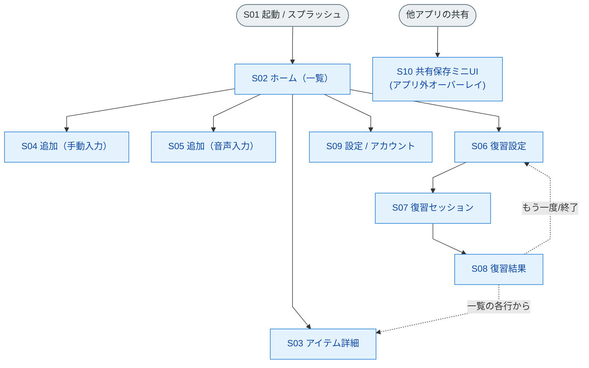

# Rakuku 画面一覧

> 本書は `docs/requirements.md`（要件定義書 v1.1）・`docs/screen-flow.md`（画面遷移図）に基づく画面の一覧資料。
> 実装・デザイン・レビューの共通リファレンスとして用いる。

- **対象**: Rakuku MVP
- **最終更新**: 2026-06-04
- **関連**: [要件定義書](./requirements.md) ／ [画面遷移図](./screen-flow.md) ／ [システム構成図](./architecture.md)

---

## 画面数サマリ

| 区分 | 数 |
|---|---|
| **主要画面** | **10** |
| 補助UI（ダイアログ・オーバーレイ等） | 4 |
| 外部委譲（OS/OAuth） | 1 |

> 「主要画面」= ユーザーが明確に滞在する画面。モーダル/シート形式の追加画面も1画面として数える。
> 共有保存のミニUIはアプリ外オーバーレイのため補助UIに分類。

---

## 主要画面一覧（10画面）

| ID | 画面名 | 種別 | 目的 | 主な構成要素 | 遷移元 → 遷移先 | 関連要件 |
|---|---|---|---|---|---|---|
| **S01** | スプラッシュ / 起動 | 画面 | 起動時の初期化・匿名サインイン（自動） | ロゴ、ローディング | 起動 → S02 | §5.6 |
| **S02** | ホーム（アイテム一覧） | 画面 | 保存アイテムの一覧・各機能の起点 | アイテムリスト（ステータスバッジ）、ブックマーク絞り込み、追加ボタン（手動/音声）、復習ボタン、設定 | S01/各画面 → S03〜S10 | §5.4, §5.8, §5.9 |
| **S03** | アイテム詳細 | 画面 | 1アイテムの学習情報の閲覧・操作 | 原文、意味、コアイメージ、ニュアンス、例文、音声再生、ブックマークON/OFF、再生成、削除 | S02 → S02（戻る/削除） | §5.2, §5.3, §5.8 |
| **S04** | アイテム追加（手動入力） | モーダル/シート | テキストを手入力して保存 | テキスト入力欄、保存ボタン | S02 → S02 | §5.1-B |
| **S05** | アイテム追加（音声入力） | モーダル/シート | 発話 → 認識候補から選択して保存 | マイク（録音）、認識候補リスト、選択、保存 | S02 → S02 | §5.1-C |
| **S06** | 復習設定 | 画面 | 出題条件を選んで復習開始 | 出題数選択（5/10/20/50/100）、対象選択（全件/ブックマーク）、開始ボタン | S02 → S07 | §5.5 |
| **S07** | 復習セッション | 画面 | タイピング想起で1問ずつ回答 | 意味提示、英語入力欄、回答する（何度でも可・初回外しは不正解・正解まで次へ進めない）、ヒント、答えを見る（カラオケ式ゴースト＋誤字ブロック） | S06 → S08 | §5.5, §5.9 |
| **S08** | 復習結果 | 画面 | セッション結果の表示・直後の振り返り | 出題アイテム一覧＋判定（覚えた/うろ覚え/苦手）、各行→詳細、正答数（覚えた件数）、ステータス内訳、もう一度／終了 | S07 → S03/S06/S02 | §5.5, §5.9 |
| **S09** | 設定 / アカウント | 画面 | アカウント・各種設定 | ログイン状態、Googleログイン（昇格）、各種設定 | S02 → S02 | §5.6 |
| **S10** | 共有保存ミニUI | オーバーレイ（アプリ外） | 他アプリから「共有」でアプリを開かず保存 | 受信テキスト確認、保存、トースト | 他アプリ → 元アプリ（任意でS02） | §5.1-A |

> S04/S05 は「アイテム追加」の入力モード違い。実装上は共通の追加フローとして統合してもよい。
> S10 は OS の共有シート/インテントから起動する独立フロー（アプリ本体の遷移とは分離）。

---

## 補助UI（ダイアログ・状態）— 4件

| ID | 名称 | 種別 | 目的 | 関連画面 |
|---|---|---|---|---|
| D01 | 削除確認ダイアログ | ダイアログ | 破壊的操作の確認 | S03 |
| D02 | 解説 生成中 / 生成エラー（再試行） | インライン状態 | AI生成の進行・失敗表示と再試行 | S03 |
| D03 | 音声 認識中 / 認識失敗 | インライン状態 | STTの進行・失敗表示 | S05 |
| D04 | 同期中 / オフライン表示 | インライン状態 | 同期状況・オフラインの提示 | S02 ほか |

## 外部委譲 — 1件

| ID | 名称 | 種別 | 備考 |
|---|---|---|---|
| X01 | Googleログイン | OS/OAuth画面 | Supabase Auth 経由。アプリ独自画面ではなくOS/Webの認証フロー | 

---

## 画面ごとの状態バリエーション（実装時に考慮）

| 画面 | 状態 |
|---|---|
| S02 ホーム | 通常 / 空（アイテム0件） / ローディング / 同期中 / オフライン |
| S03 詳細 | 生成中（プレースホルダ） / 生成済 / 生成エラー（再試行） |
| S05 音声入力 | 待機 / 録音中 / 認識候補表示 / 認識失敗 |
| S06 復習設定 | 通常 / 対象0件（開始不可） |
| S07 復習セッション | 出題中 / 再回答中（初回不正解・正解未達で次へ不可） / ヒント表示 / 答え表示（ゴースト＋タイプ強制） |
| S08 復習結果 | 通常（出題一覧＋判定3区分） / 出題0件 |

---

## 画面マップ（ID付き）

---

*本書は要件定義書 v1.1 に追従する。要件変更時は本一覧も更新する。*
